# Requirements Elicitation & Analysis

## 2.1 Competidores

### 2.1.1 Análisis Competitivo

| **¿Por qué llevar a cabo este análisis?** | El objetivo de este análisis es evaluar las soluciones tecnológicas existentes en el mercado de monitoreo ambiental y gestión de obras —tanto a nivel de hardware especializado como de plataformas SaaS y suites de construcción— para identificar brechas operativas en el sector de infraestructura vial. A través de este contraste, VíaNexo busca validar su posicionamiento estratégico basado en un modelo híbrido HaaS/SaaS neutral, automatización preventiva de incidencias y aseguramiento de datos inalterables frente a la competencia directa e indirecta. |
| :--- | :--- |

| **Categoría** | **RoadWatch OS (VíaNexo)** | **SiteHive** | **Sonitus Systems** | **Autodesk Construction Cloud** |
| :--- | :---: | :---: | :---: | :---: |
| **Cabecera** |  | 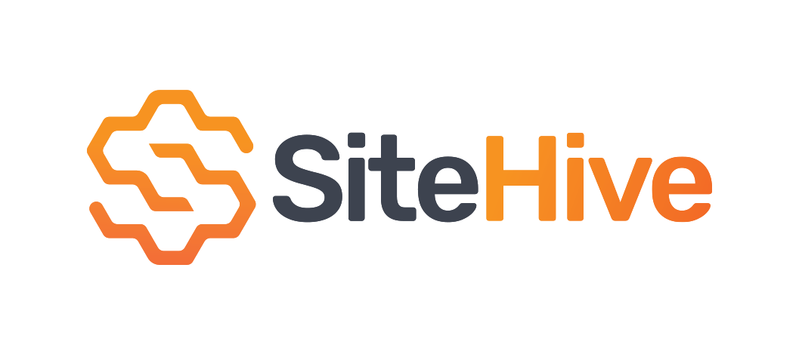 |  |  |
| **Perfil** | | | | |
| **Overview** | Plataforma HaaS/SaaS integrada con red propia de nodos IoT en comodato para monitoreo ambiental (aire, ruido, agua) y gestión preventiva en obras viales. | Plataforma SaaS australiana especializada en monitoreo ambiental continuo (ruido, polvo, vibración) para construcción y minería. | Proveedor global especializado en instrumentación y monitores IoT de nivel de ruido y calidad del aire para monitoreo ambiental. | Suite integral de software basada en la nube para la gestión de proyectos de construcción, flujos de trabajo BIM y control documental. |
| **Ventaja competitiva (valor al cliente)** | Modelo HaaS sin inversión inicial de hardware, rol de árbitro neutral con telemetría inalterable y motor de mitigación preventiva para constructoras y supervisoras. | Automatización del procesamiento de datos ambientales de campo con algoritmos de reconocimiento de eventos de ruido mediante IA. | Equipos de medición de alta robustez, precisión instrumental y cumplimiento estricto de estándares internacionales de calibración sonora. | Integración nativa y madura con modelos BIM (Revit/Civil 3D), gestión de calidad global y amplia adopción corporativa en el sector. |
| **Perfil de Marketing** | | | | |
| **Mercado objetivo** | Empresas constructoras viales medianas/grandes y consultoras supervisoras ambientales registradas (RNCA/SENACE) en Perú y LatAm. | Contratistas generales de edificación e infraestructura pesada en Australia, Nueva Zelanda, Reino Unido y Norteamérica. | Consultores acústicos, autoridades municipales, firmas ambientales y proyectos industriales a nivel internacional. | Empresas constructoras de gran envergadura, consorcios de ingeniería, firmas de diseño y entidades públicas a nivel global. |
| **Estrategias de marketing** | Alianzas con gremios sectoriales (CAPECO), prospección directa B2B a consultoras del RNCA y conferencias de infraestructura vial. | Inbound marketing, casos de éxito en megaproyectos urbanos, marketing de contenidos sobre sostenibilidad y webinars técnicos. | Venta consultiva técnica B2B, presencia en ferias de instrumentación acústica/ambiental y red de distribuidores de hardware. | Campañas masivas B2B, certificaciones profesionales oficiales, red de partners globales y promociones integradas en el ecosistema Autodesk. |
| **Perfil de Producto** | | | | |
| **Productos & Servicios** | Red de nodos IoT (ruido, material particulado, calidad de agua), tablero geolocalizado multitramo, sistema de tickets preventivos y reportes legales en PDF. | Dispositivos de monitoreo SiteHive (Hexanode), software cloud con mapas en tiempo real, alertas por correo/SMS y reportes de cumplimiento. | Equipos de medición física (sonómetros Sonitus EM2010, monitores de polvo) integrados a su plataforma web Sonitus Cloud de análisis histórico. | Módulos de Autodesk Build, BIM Collaborate, Docs y Takeoff; herramientas de incidencias generales (RFI), planos y control de avance. |
| **Precios & Costos** | Suscripción dual HaaS mensual o anual (planes Base, Profesional, Enterprise) que incluye hardware, soporte y calibración de fábrica. | Suscripción SaaS por dispositivo activo al mes/año; el hardware requiere alquiler por separado o compra directa del kit. | Venta directa de hardware (costo de capital elevado por equipo) más suscripción periódica por acceso a la plataforma Sonitus Cloud. | Licenciamiento por usuario/mes o esquema corporativo por volumen de facturación del proyecto (tarifas premium elevadas). |
| **Canales de distribución** | Plataforma Web responsiva accesible vía navegador de escritorio y móvil, con despliegue de hardware directo en tramos viales. | Aplicación Web para navegador y versión optimizada para navegadores móviles. | Plataforma Web (Sonitus Cloud) y distribución física de sensores a través de canales logísticos y representantes locales. | Aplicación Web de escritorio, aplicaciones móviles dedicadas (iOS y Android) y extensiones de escritorio integradas. |
| **Análisis SWOT** | *Fortalezas apoyan oportunidades y fundamentan la ventaja competitiva.* | | | |
| **Fortalezas** | Modelo de ingresos HaaS (cero CapEx en sensores para el cliente), módulos desacoplados para constructora y supervisora con datos inalterables. | Plataforma de software intuitiva, algoritmos avanzados de clasificación de fuentes de ruido y marca validada en mercados desarrollados. | Alta precisión de hardware, sensores certificados bajo normas IEC/ISO y larga vida útil de los equipos en campo. | Posición dominante del mercado global, ecosistema de software interconectado y solidez técnica/financiera corporativa. |
| **Debilidades** | Startup en etapa inicial, catálogo de parámetros físicos limitado al alcance de la primera versión y red operativa de despliegue en consolidación. | Dependencia de conectividad de red celular estable, costos elevados para proyectos medianos en economías emergentes y soporte regional limitado. | La plataforma de software funciona principalmente como visor pasivo de telemetría, careciendo de gestión preventiva operativa de obra. | No cuenta con verticalización nativa para estándares ambientales locales (ECA Perú) ni provisión propia de hardware IoT ambiental. |
| **Oportunidades** | Normativas ambientales peruanas más rigurosas (fiscalización continua MTC/OEFA) y necesidad de mitigar riesgos de sanciones en obras viales. | Expansión hacia regulaciones de descarbonización e iniciativas ESG en obras de infraestructura civil internacional. | Crecimiento de proyectos de ciudades inteligentes y ordenanzas municipales de control estricto de contaminación sonora. | Adquisición o integración de plugins IoT de terceros para centralizar mediciones ambientales dentro de Autodesk Construction Cloud. |
| **Amenazas** | Reticencia cultural al cambio tecnológico en obras de provincias y demoras administrativas en la adopción por parte de consultoras públicas. | Entrada de proveedores de hardware de bajo costo con capacidades de software genéricas. | Competidores locales que ofrecen calibración y alquiler de instrumental tradicional a tarifas reducidas por jornada. | Desarrollo de módulos nativos de gestión ambiental y sostenibilidad dentro de la suite de Autodesk a corto plazo. |

### 2.1.2. Estrategias y tácticas frente a competidores

Para posicionar a RoadWatch frente a la competencia de aplicaciones de navegación de consumo masivo (como Waze o Google Maps) y plataformas tradicionales de analítica de tráfico corporativo (como INRIX o TomTom Enterprise), se implementan las siguientes estrategias y tácticas competitivas:

Estrategia de Accesibilidad y Datos Integrados (Modelo SaaS / DaaS): A diferencia de los costosos sistemas de gestión de tráfico que exigen la instalación de infraestructura propia (sensores físicos) o licencias corporativas prohibitivas, RoadWatch ofrece un modelo flexible basado en la nube (Software as a Service / Data as a Service). Al combinar inteligencia colectiva (crowdsourcing) con la integración de datos abiertos e IoT, se elimina la barrera financiera de entrada para empresas de logística medianas, operadores de transporte y municipalidades, democratizando el acceso a la analítica de movilidad avanzada.

Enfoque Operativo y de Seguridad (Más allá de la Navegación Pasiva): Mientras que las aplicaciones de consumo masivo actúan meramente como visores pasivos que sugieren rutas al conductor individual, RoadWatch integra el monitoreo vial directamente con un flujo completo de respuesta operativa para organizaciones: detección de incidente o congestión severa → alerta automática a la central → creación de ticket de contingencia → asignación de ruta alternativa para la flota (o aviso a servicios de emergencia) → registro del evento y normalización de la vía.

Gestión Multi-Flota y Control Zonal Centralizado: Se despliega una arquitectura pensada para que las autoridades de tránsito, administradores de flotas logísticas y operadores de emergencias gestionen múltiples rutas, unidades vehiculares o sectores urbanos simultáneamente. Todo esto se realiza desde una única cuenta centralizada y un dashboard geolocalizado unificado, optimizando el control y la toma de decisiones rápidas de los supervisores de ruta y despachadores.

Estrategia Comercial B2B / B2G Dirigida: La prospección se enfoca directamente en gerentes de logística, directores de operaciones de transporte y autoridades de movilidad urbana. Esta estrategia se apoya en alianzas clave con gremios de transporte (cámaras de comercio, gremios de carga) y entidades gubernamentales (como el MTC, ATU o SUTRAN), demostrando con datos una reducción directa en los costos operativos por tiempos muertos, mejora en los tiempos de respuesta ante emergencias y disminución de los riesgos de siniestralidad vial.

## 2.2 Entrevistas

### 2.2.1 Diseño de Entrevistas

#### Preguntas presentación

- ¿Hola cuál es tu nombre y edad?
- ¿Cuál es tu cargo actual y hace cuánto tiempo te desempeñas en él?
- ¿Cuáles son tus principales responsabilidades del día a día en relación con la gestión o supervisión ambiental del proyecto?

### Segmento 1: Líderes o jefes de gestión de proyectos viales (Empresas Constructoras)

#### Preguntas principales:

1. Buen día, ¿podría comentarme su nombre, edad y el puesto que desempeña dentro de la constructora?

2. ¿Cuántos frentes de obra o tramos viales tienen actualmente en ejecución bajo su cargo?

3. ¿Cómo realizan actualmente el registro y seguimiento de los indicadores ambientales (aire, ruido, agua) en los frentes de trabajo?

4. ¿Qué herramientas utilizan el equipo de campo y la oficina central para compartir las mediciones, fotografías de evidencias y reportes ambientales?

5. Al ejecutar y gestionar varios frentes/tramos viales simultáneamente, ¿qué tan complicado resulta mantener organizada y al día toda la documentación e historial ambiental?

6. ¿Qué ocurre o qué protocolo siguen cuando en campo detectan que un indicador (como polvo o ruido) está cerca de superar o ya superó el límite del ECA/LMP?

7. Tras detectar una incidencia o recibir una observación de la supervisión, ¿cómo asignan y hacen el seguimiento a las acciones de mitigación en campo?

8. ¿Qué dificultades enfrentan al momento de consolidar la información para responder a las auditorías de la supervisión o ante entidades fiscalizadoras (ej. OEFA / MTC)?

9. ¿Cuál considera que es la principal dificultad que enfrentan como constructora al gestionar la parte ambiental en múltiples tramos a la vez?

10. Si pudiera cambiar una sola cosa del proceso con el que gestionan las contingencias ambientales en obra, ¿qué cambiaría?

11. ¿Considera útil contar con alertas telemáticas o sensores que les avisen automáticamente antes de sobrepasar los límites normativos?

12. Finalmente, ¿qué información o indicador considera crítico tener a la mano para garantizar que la obra no sea paralizada ni sancionada ambientalmente?

### Segmento 2: Empresas Supervisoras y Consultoras Ambientales (Múltiples Proyectos)

1. Buen día, ¿podría comentarme su nombre, edad y puesto que desempeña en el rubro de supervisión o consultoría ambiental?

2. En primer lugar, ¿cómo realizan actualmente el seguimiento de los indicadores ambientales de los proyectos que supervisan, como aire, ruido y agua?

3. ¿Qué herramientas utilizan para recibir y compartir las mediciones, fotografías y documentos de los diferentes proyectos?

4. Al supervisar varios proyectos, ¿qué tan complicado es mantener organizada toda la información ambiental?

5. ¿Qué ocurre cuando detectan una medición que podría representar un incumplimiento ambiental?

6. ¿Cómo realizan actualmente el seguimiento de las acciones correctivas después de detectar una incidencia?

7. ¿Qué dificultades encuentran al momento de preparar informes para una auditoría o fiscalización?

8. Entrevistador: ¿Cuál considera que es la principal dificultad al supervisar ambientalmente varios proyectos?

9. Entrevistador: Si pudiera cambiar una sola cosa del proceso actual, ¿qué cambiaría?

10. Entrevistador: ¿Considera útil recibir información ambiental directamente desde sensores instalados en los proyectos?

11. Entrevistador: Finalmente, ¿qué información considera más importante para supervisar correctamente el estado ambiental de los proyectos?

### 2.2.2 Registro de Entrevistas

### Segmento 1:

 
<table>
<thead>
  <tr>
    <th colspan="2">Entrevista #1</th>
  </tr>
</thead>
<tbody>
  <tr>
    <td>Nombre</td>
    <td>Keler Martín</td>
  </tr>
  <tr>
    <td>Apellidos</td>
    <td>Panduro Perez</td>
  </tr>
  <tr>
    <td>Edad</td>
    <td>26</td>
  </tr>
  <tr>
    <td>Distrito</td>
    <td>Santiago de Surco</td>
  </tr>
  <tr>
    <td>Evidencia</td>
    <td></td>
  </tr>
  <tr>
    <tr>
  <td>Link</td>
  <td><a href="https://1drv.ms/v/c/113B281D1AF386CE/IQCjOQL_AoaeSZHjG8hdwrqxAaD3T-ASMCIQkltoW0Mx8QI?e=tux0nT" target="_blank">Ver video</a></td>
</tr>
  </tr>
  <tr>
    <td>Duración</td>
    <td>0:00-6:23</td>
  </tr>
  <tr>
    <td>Resumen</td>
    <td>Keler es un residente de obra y jefe de gestión ambiental en una empresa constructora vial, encargado de supervisar el cumplimiento del Plan de Manejo Ambiental en múltiples frentes de trabajo simultáneos. Para el registro de indicadores (como polvo y ruido), las coordinaciones en campo y el envío de evidencias, utiliza una combinación de herramientas fragmentadas que incluyen hojas de Excel, archivos de Word, mensajes de WhatsApp, carpetas compartidas y reportes manuales diferidos. Busca garantizar la continuidad de la obra sin paralizaciones ni sanciones y mantener al día la documentación socioambiental. Sin embargo, enfrenta serias dificultades debido a la falta de visibilidad en tiempo real de lo que ocurre en cada tramo; al depender de mediciones manuales o informes periódicos de laboratorio, suele enterarse tarde de la superación de límites permisibles, muchas veces cuando ya existen quejas de las comunidades o penalizaciones de la supervisión. Además, la dispersión de la información le exige invertir un tiempo excesivo buscando fotos y documentos no etiquetados para consolidar a última hora los expedientes requeridos en auditorías o fiscalizaciones de organismos como el MTC o el OEFA. Keler considera que contar con una plataforma centralizada y conectada a sensores IoT telemáticos que envíen alertas preventivas en tiempo real, tendría un impacto sumamente positivo, ya que le permitiría aplicar medidas de mitigación inmediatas, evitar multas y automatizar la trazabilidad de sus operaciones en campo.</td>
  </tr>
</tbody>
</table>

<table>
<thead>
  <tr>
    <th colspan="2">Entrevista #2</th>
  </tr>
</thead>
<tbody>
  <tr>
    <td>Nombre</td>
    <td>Becker</td>
  </tr>
  <tr>
    <td>Apellidos</td>
    <td>Junior Caisahuana</td>
  </tr>
  <tr>
    <td>Edad</td>
    <td>23</td>
  </tr>
  <tr>
    <td>Distrito</td>
    <td>Rímac</td>
  </tr>
  <tr>
    <td>Evidencia</td>
    <td></td>
  </tr>
  <tr>
    <td>Link</td>
    <td><a href="https://upcedupe-my.sharepoint.com/:v:/g/personal/u202412462_upc_edu_pe/IQA9cO_PRBJ_Sq6Tgr_t7IVSAVcPJytqUE5tl3gnlsr-RjE?nav=eyJyZWZlcnJhbEluZm8iOnsicmVmZXJyYWxBcHAiOiJTdHJlYW1XZWJBcHAiLCJyZWZlcnJhbFZpZXciOiJTaGFyZURpYWxvZy1MaW5rIiwicmVmZXJyYWxBcHBQbGF0Zm9ybSI6IldlYiIsInJlZmVycmFsTW9kZSI6InZpZXcifX0%3D&e=mWKUwf" target="_blank">Ver video</a></td>
  </tr>
  <tr>
    <td>Duración</td>
    <td>0:00 - 2:31</td>
  </tr>
  <tr>
    <td>Resumen</td>
    <td>Becker es jefe de proyectos en una empresa constructora y se encarga de coordinar diferentes frentes de obra, revisar avances y asegurar el cumplimiento de los requerimientos técnicos y ambientales de los proyectos. Para realizar el seguimiento de indicadores ambientales como ruido, polvo y calidad del agua, su equipo efectúa mediciones en campo y registra los resultados mediante hojas de Excel, informes, fotografías, correos electrónicos, carpetas compartidas y mensajes de WhatsApp. Sin embargo, al gestionar varios frentes de manera simultánea, enfrenta dificultades para mantener toda la información organizada y localizar rápidamente las evidencias necesarias, debido a que los datos se encuentran dispersos en diferentes canales y formatos. Asimismo, la identificación de riesgos ambientales depende en gran medida de que el personal responsable detecte oportunamente una posible superación de los límites permitidos y la comunique al equipo, lo que puede retrasar la aplicación de medidas preventivas. Becker considera que contar con sensores y alertas automáticas permitiría anticiparse a situaciones críticas y ejecutar acciones de mitigación antes de que ocurra un incumplimiento o una observación por parte de la supervisión. Además, destaca la necesidad de contar con una plataforma centralizada en la que pueda visualizar el estado de cada frente de obra, sus mediciones, alertas, incidencias, acciones pendientes y evidencias, facilitando una respuesta más rápida y una mejor organización de la información ante futuras supervisiones.</td>
  </tr>
</tbody>
</table>

<table>
<thead>
  <tr>
    <th colspan="2">Entrevista #3</th>
  </tr>
</thead>
<tbody>
  <tr>
    <td>Nombre</td>
    <td>Jaime</td>
  </tr>
  <tr>
    <td>Apellidos</td>
    <td>Ronceros</td>
  </tr>
  <tr>
    <td>Edad</td>
    <td>38</td>
  </tr>
  <tr>
    <td>Distrito</td>
    <td>Chorrillos</td>
  </tr>
  <tr>
    <td>Evidencia</td>
    <td>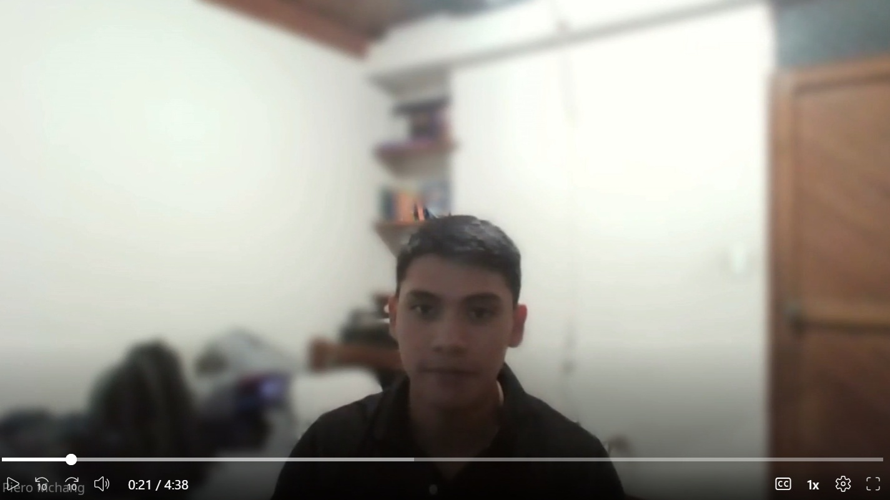</td>
  </tr>
  <tr>
    <td>Link</td>
    <td><a href="https://upcedupe-my.sharepoint.com/:v:/g/personal/u202410421_upc_edu_pe/IQDMrm1dTpBKQIp0LJuhOQPqAcATYsKr9jOZ-jhzBrSptDA?nav=eyJyZWZlcnJhbEluZm8iOnsicmVmZXJyYWxBcHAiOiJTdHJlYW1XZWJBcHAiLCJyZWZlcnJhbFZpZXciOiJTaGFyZURpYWxvZy1MaW5rIiwicmVmZXJyYWxBcHBQbGF0Zm9ybSI6IldlYiIsInJlZmVycmFsTW9kZSI6InZpZXcifX0%3D&e=nC841P" target="_blank">Ver video</a></td>
  </tr>
  <tr>
    <td>Duración</td>
    <td>0:00 - 4:38</td>
  </tr>
  <tr>
    <td>Resumen</td>
    <td>Jaime participa en la gestión y seguimiento ambiental de proyectos de construcción vial, donde es necesario supervisar simultáneamente distintos frentes de obra y verificar el cumplimiento de los indicadores ambientales establecidos para cada proyecto. Actualmente, las mediciones relacionadas con factores como calidad del aire, ruido y agua se realizan en campo y posteriormente son registradas en hojas de cálculo, formatos e informes, mientras que las evidencias y coordinaciones se distribuyen entre herramientas como Excel, correo electrónico, WhatsApp y carpetas compartidas. Esta forma de trabajo genera dificultades para mantener la información organizada, actualizada y asociada correctamente a cada tramo, fecha y punto de monitoreo, especialmente cuando se gestionan varios frentes al mismo tiempo. Ante la detección de valores cercanos o superiores a los límites ambientales permitidos, el personal responsable debe comunicar la incidencia y coordinar medidas de mitigación, como incrementar el riego de las vías, controlar la velocidad de los vehículos, modificar horarios de actividades o identificar equipos que estén generando niveles elevados de ruido. Sin embargo, este proceso depende principalmente de la detección y comunicación oportuna por parte del personal. Jaime considera que una plataforma centralizada permitiría visualizar en un solo lugar las mediciones, incidencias, responsables, acciones de mitigación y evidencias de todos los frentes de obra. Asimismo, considera beneficioso incorporar sensores y alertas automáticas que permitan identificar anticipadamente cuándo un indicador se aproxima a un límite normativo, facilitando una respuesta preventiva antes de que se produzca un incumplimiento. También destaca la importancia de conocer el valor actual de cada indicador, el límite permitido, su evolución, la ubicación del punto de monitoreo y las incidencias pendientes con sus respectivos responsables, lo que contribuiría a mejorar la toma de decisiones y reducir el riesgo de observaciones, sanciones o paralizaciones.</td>
  </tr>
</tbody>
</table>

 

### Segmento 2:

 

<table>
<thead>
  <tr>
    <th colspan="2">Entrevista #1</th>
  </tr>
</thead>
<tbody>
  <tr>
    <td>Nombre</td>
    <td>Angiela</td>
  </tr>
  <tr>
    <td>Apellidos</td>
    <td>Fuentes Alvarez</td>
  </tr>
  <tr>
    <td>Edad</td>
    <td>24</td>
  </tr>
  <tr>
    <td>Distrito</td>
    <td>San Juan de Lurigancho</td>
  </tr>
 <tr>
  <td>Evidencia</td>
  <td></td>
</tr>
  <tr>
    <tr>
  <td>Link</td>
  <td><a href="https://1drv.ms/v/c/113B281D1AF386CE/IQDGziSKN-XBRKO401eqvDWJARuiheeZ5hj3WNWlq3t0GE8?e=MV9WvJ" target="_blank">Ver video</a></td>
</tr>
  </tr>
  <tr>
    <td>Duración</td>
    <td>0:00 - 4:23</td>
  </tr>
  <tr>
    <td>Resumen</td>
    <td>Angiela es una supervisora y consultora ambiental encargada de monitorear los indicadores de aire, ruido y agua en múltiples proyectos simultáneos. Para el control, seguimiento y recepción de evidencias, utiliza un conjunto de herramientas fragmentadas que incluyen Excel, correos electrónicos, WhatsApp, carpetas compartidas y documentos físicos. Busca garantizar el cumplimiento ambiental de todos los proyectos y agilizar la preparación de informes para auditorías o fiscalizaciones. Sin embargo, enfrenta grandes dificultades debido a la falta de centralización de la información; al manejar distintos formatos y canales por cada proyecto, se ve obligada a invertir demasiado tiempo en consolidar datos y rastrear evidencias. Esta desorganización le impide tener una visión global clara sobre qué proyectos tienen incidencias abiertas o están próximos a un incumplimiento. Angiela considera que contar con una plataforma centralizada —integrada con sensores IoT para recibir alertas en tiempo real— tendría un impacto sumamente positivo, ya que automatizaría su trabajo y mejoraría el éxito ambiental de sus proyectos.</td>
  </tr>
</tbody>
</table>

<table>
<thead>
  <tr>
    <th colspan="2">Entrevista #2</th>
  </tr>
</thead>
<tbody>
  <tr>
    <td>Nombre</td>
    <td>Guadalupe</td>
  </tr>
  <tr>
    <td>Apellidos</td>
    <td>Kim Chang</td>
  </tr>
  <tr>
    <td>Edad</td>
    <td>44</td>
  </tr>
  <tr>
    <td>Distrito</td>
    <td>San Isidro</td>
  </tr>
  <tr>
    <td>Evidencia</td>
    <td></td>
  </tr>
  <tr>
    <td>Link</td>
    <td><a href="https://upcedupe-my.sharepoint.com/:v:/g/personal/u202410421_upc_edu_pe/IQAzGWBr_180TaX5r2Ce2iHmAa0uzBUXWMWKYnJheWzFmdM?e=lzPTKe&nav=eyJyZWZlcnJhbEluZm8iOnsicmVmZXJyYWxBcHAiOiJTdHJlYW1XZWJBcHAiLCJyZWZlcnJhbFZpZXciOiJTaGFyZURpYWxvZy1MaW5rIiwicmVmZXJyYWxBcHBQbGF0Zm9ybSI6IldlYiIsInJlZmVycmFsTW9kZSI6InZpZXcifX0%3D" target="_blank">Ver video</a></td>
  </tr>
  <tr>
    <td>Duración</td>
    <td>0:00 - 5:34</td>
  </tr>
  <tr>
    <td>Resumen</td>
    <td>Guadalupe desempeña funciones de supervisión y coordinación, realizando seguimiento a diferentes actividades y proyectos, revisando información, verificando el cumplimiento de procesos y coordinando con los responsables cuando se detectan observaciones o incidencias. Para el seguimiento ambiental utiliza principalmente reportes, hojas de cálculo, informes, correos electrónicos, carpetas compartidas y WhatsApp, lo que genera que la información se encuentre distribuida en diversos canales. Esta fragmentación dificulta localizar rápidamente mediciones, documentos, fotografías, incidencias y acciones correctivas, especialmente cuando se supervisan varios proyectos de manera simultánea. Además, señala que el seguimiento suele ser reactivo debido a que las mediciones no siempre están disponibles de forma inmediata y que el control de incidencias abiertas y acciones pendientes requiere una revisión manual. Guadalupe considera que una plataforma centralizada con alertas preventivas permitiría mejorar significativamente este proceso, especialmente si incorpora estados visuales como verde, amarillo y rojo para identificar rápidamente situaciones normales, de atención o críticas. Asimismo, considera útil integrar sensores para obtener información continua y facilitar la supervisión remota, sin reemplazar completamente las visitas presenciales. Destaca también la importancia de conservar un historial completo de mediciones, incidencias, responsables, acciones correctivas y evidencias para auditorías o fiscalizaciones. Finalmente, considera que una solución ideal debería ofrecer una vista general de todos los proyectos, visualización geográfica mediante mapas, alertas automáticas y generación de reportes descargables en PDF o Excel, reduciendo así el trabajo manual y facilitando la toma de decisiones.</td>
  </tr>
</tbody>
</table>

<table>
<thead>
  <tr>
    <th colspan="2">Entrevista #3</th>
  </tr>
</thead>
<tbody>
  <tr>
    <td>Nombre</td>
    <td>Guillermo</td>
  </tr>
  <tr>
    <td>Apellidos</td>
    <td>Llanos</td>
  </tr>
  <tr>
    <td>Edad</td>
    <td>28</td>
  </tr>
  <tr>
    <td>Distrito</td>
    <td>Santiago de Surco</td>
  </tr>
  <tr>
    <td>Evidencia</td>
    <td>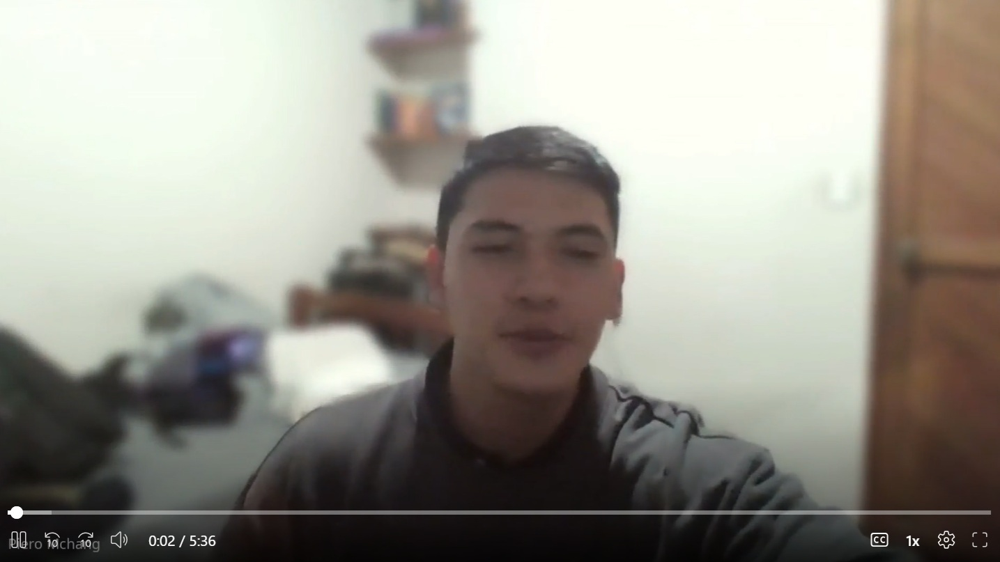</td>
  </tr>
  <tr>
    <td>Link</td>
    <td><a href="https://upcedupe-my.sharepoint.com/:v:/g/personal/u202410421_upc_edu_pe/IQAa6Wi1mjFZT5H0oqBz-c7bASPxmtXKCORbRvL66ru_8GA?nav=eyJyZWZlcnJhbEluZm8iOnsicmVmZXJyYWxBcHAiOiJTdHJlYW1XZWJBcHAiLCJyZWZlcnJhbFZpZXciOiJTaGFyZURpYWxvZy1MaW5rIiwicmVmZXJyYWxBcHBQbGF0Zm9ybSI6IldlYiIsInJlZmVycmFsTW9kZSI6InZpZXcifX0%3D&e=Cpf84c" target="_blank">Ver video</a></td>
  </tr>
  <tr>
    <td>Duración</td>
    <td>0:00 - 5:36</td>
  </tr>
  <tr>
    <td>Resumen</td>
    <td>Guillermo participa en actividades relacionadas con la supervisión y seguimiento ambiental de diferentes proyectos, donde es necesario revisar mediciones, informes, evidencias y observaciones para verificar el cumplimiento de los compromisos ambientales establecidos. Actualmente, el seguimiento de indicadores como calidad del aire, ruido y agua se realiza mediante los registros generados por cada proyecto, complementados con informes de los responsables ambientales y verificaciones realizadas en campo. Para gestionar esta información se utilizan principalmente hojas de Excel, correos electrónicos, documentos PDF, carpetas compartidas y aplicaciones de mensajería como WhatsApp. Sin embargo, al supervisar varios proyectos simultáneamente, la información puede encontrarse distribuida en diferentes formatos y ubicaciones, lo que dificulta mantener un historial organizado y obtener rápidamente una visión general del estado ambiental de cada proyecto. Cuando se identifica una medición que podría representar un incumplimiento, se verifica su correspondencia con el punto de monitoreo y periodo evaluado, se compara con los límites aplicables y, de ser necesario, se comunica la observación al responsable para solicitar la implementación de medidas correctivas. El seguimiento de estas acciones suele realizarse manualmente mediante matrices, correos, reuniones y evidencias como fotografías, documentos o nuevas mediciones. Guillermo considera que centralizar la información en una sola plataforma permitiría consultar las mediciones actuales e históricas, incidencias, acciones correctivas y evidencias de diferentes proyectos de una manera más eficiente. Asimismo, considera útil obtener información directamente desde sensores para contar con una visión más continua de los indicadores ambientales, siempre que se garantice la calibración de los equipos, la confiabilidad de los datos y su trazabilidad. Además, destaca la importancia de visualizar la ubicación de los puntos de monitoreo, los valores permitidos, la evolución de los indicadores y el estado de las observaciones pendientes, facilitando así la fiscalización, la elaboración de informes y la toma de decisiones durante la supervisión ambiental.</td>
  </tr>
</tbody>
</table>

### 2.2.3 Análisis de Entrevistas

**Segmento 1: Líderes o jefes de gestión de proyectos viales – Empresas Constructoras**

| Característica                                             | Mención |   %   | Evidencia                                                                                                                                                                                            |
| :--------------------------------------------------------- | :-----: | :---: | :--------------------------------------------------------------------------------------------------------------------------------------------------------------------------------------------------- |
| Uso de herramientas y canales fragmentados                 |   3/3   |  100% | Keler, Becker y Jaime utilizan Excel, WhatsApp, correos, carpetas compartidas, informes y otros medios separados para gestionar mediciones y evidencias ambientales.                                 |
| Dificultad para organizar información de múltiples frentes |   3/3   |  100% | Los entrevistados señalan que gestionar varios frentes simultáneamente dificulta mantener actualizados y correctamente asociados los documentos, mediciones, fotografías y evidencias.               |
| Necesidad de una plataforma centralizada                   |   3/3   |  100% | Los tres entrevistados consideran necesario disponer de una plataforma que concentre mediciones, incidencias, responsables, acciones y evidencias de todos los frentes de obra.                      |
| Interés en sensores y alertas preventivas                  |   3/3   |  100% | Keler, Becker y Jaime consideran beneficioso utilizar sensores IoT y alertas automáticas para detectar anticipadamente valores cercanos a los límites ambientales permitidos.                        |
| Seguimiento ambiental principalmente manual o reactivo     |   3/3   |  100% | Las mediciones y comunicaciones dependen actualmente de registros manuales, reportes periódicos o de que el personal detecte y comunique oportunamente una situación de riesgo.                      |
| Necesidad de visibilidad en tiempo real                    |   3/3   |  100% | Los entrevistados manifiestan la necesidad de conocer oportunamente lo que ocurre en cada tramo para evitar reaccionar cuando el incumplimiento o la observación ya se produjo.                      |
| Importancia de la trazabilidad de incidencias y evidencias |   3/3   |  100% | Se requiere mantener información asociada al tramo, fecha, punto de monitoreo, responsables, acciones ejecutadas y evidencias que permitan reconstruir el historial de una incidencia.               |
| Riesgo de sanciones, observaciones o paralizaciones        |   3/3   |  100% | Una preocupación recurrente es detectar los problemas ambientales antes de que generen observaciones de supervisión, multas, incumplimientos o paralizaciones de la obra.                            |
| Necesidad de gestionar acciones de mitigación              |   3/3   |  100% | Ante una incidencia se deben ejecutar acciones como riego de vías, control de velocidad, modificación de horarios u otras medidas, además de verificar posteriormente su cumplimiento.               |
| Dificultad para consolidar información para auditorías     |   2/3   | 66.7% | Keler y Becker destacan especialmente el tiempo invertido en localizar fotografías, mediciones y documentos dispersos para preparar expedientes solicitados durante supervisiones o fiscalizaciones. |

**Insights Destacados**

* La **fragmentación de la información** constituye uno de los principales problemas del segmento, ya que las mediciones, fotografías, documentos y comunicaciones se encuentran distribuidos entre Excel, WhatsApp, correos y carpetas compartidas.
* Existe una necesidad generalizada de pasar de una gestión ambiental **reactiva a una gestión preventiva**, detectando tendencias de riesgo antes de que un indicador supere los límites establecidos.
* El **100% de los entrevistados considera útil centralizar la información** de los diferentes frentes de obra en una única plataforma que permita visualizar indicadores, incidencias, responsables, acciones correctivas y evidencias.
* La incorporación de **sensores IoT y alertas automáticas** es percibida como una oportunidad para mejorar la capacidad de respuesta y reducir el riesgo de observaciones, multas o paralizaciones.
* La **trazabilidad histórica y documental** representa un aspecto crítico, especialmente para demostrar las acciones realizadas frente a una incidencia y responder de manera más eficiente ante auditorías o fiscalizaciones.

---

**Segmento 2: Empresas Supervisoras y Consultoras Ambientales – Múltiples Proyectos**

| Característica                                                        | Mención |   %   | Evidencia                                                                                                                                                                                       |
| :-------------------------------------------------------------------- | :-----: | :---: | :---------------------------------------------------------------------------------------------------------------------------------------------------------------------------------------------- |
| Uso de múltiples herramientas para gestionar información              |   3/3   |  100% | Angiela, Guadalupe y Guillermo utilizan principalmente Excel, correos electrónicos, WhatsApp, documentos PDF, carpetas compartidas y reportes para realizar el seguimiento ambiental.           |
| Dificultad para consolidar información de varios proyectos            |   3/3   |  100% | Los entrevistados indican que supervisar múltiples proyectos genera grandes cantidades de mediciones, fotografías, informes y observaciones distribuidas en distintos archivos y formatos.      |
| Necesidad de centralizar la información                               |   3/3   |  100% | Los tres participantes consideran que una plataforma centralizada permitiría revisar los diferentes proyectos sin depender de numerosos archivos, carpetas y canales de comunicación.           |
| Dificultad para obtener una visión global del estado de los proyectos |   3/3   |  100% | Actualmente resulta complicado identificar rápidamente qué proyecto presenta una incidencia, cuál posee acciones pendientes o cuál requiere mayor atención.                                     |
| Seguimiento manual de incidencias y acciones correctivas              |   3/3   |  100% | El seguimiento se realiza mediante matrices de Excel, correos, reuniones, reportes y revisión manual de evidencias entregadas por los responsables de cada proyecto.                            |
| Interés en sensores y monitoreo continuo                              |   3/3   |  100% | Los entrevistados consideran útil disponer de información obtenida mediante sensores para mejorar la supervisión y detectar con mayor rapidez cambios en los indicadores ambientales.           |
| Necesidad de alertas preventivas                                      |   2/3   | 66.7% | Angiela y Guadalupe destacan directamente la utilidad de contar con alertas que permitan identificar situaciones críticas o próximas a un incumplimiento antes de que el problema se agrave.    |
| Importancia del historial y trazabilidad                              |   3/3   |  100% | Se considera necesario disponer de registros históricos de mediciones, incidencias, responsables, acciones correctivas y evidencias para sustentar revisiones y fiscalizaciones.                |
| Dificultad para preparar auditorías e informes                        |   3/3   |  100% | La dispersión de mediciones, fotografías y documentos incrementa el tiempo requerido para consolidar información y elaborar expedientes o informes de cumplimiento.                             |
| Necesidad de geolocalización y ubicación de puntos de monitoreo       |   2/3   | 66.7% | Guadalupe destaca la visualización mediante mapas y Guillermo señala la importancia de conocer la ubicación exacta de cada punto de monitoreo para contextualizar correctamente las mediciones. |

**Insights Destacados**

* Las empresas supervisoras y consultoras enfrentan una fuerte **carga administrativa causada por la dispersión de información** proveniente de distintos proyectos, empresas y responsables.
* Existe una necesidad común de disponer de una **vista consolidada multiproyecto** que permita identificar rápidamente proyectos críticos, observaciones abiertas y acciones correctivas pendientes.
* El **100% de los entrevistados considera necesaria la centralización de mediciones, evidencias, incidencias e historial**, especialmente para reducir el tiempo dedicado a consolidar información manualmente.
* La incorporación de **sensores, alertas y visualización continua de indicadores** permitiría fortalecer la supervisión remota y detectar situaciones que requieren atención antes de convertirse en incumplimientos.
* La **trazabilidad y confiabilidad de los datos** son especialmente relevantes para este segmento, debido a que la información debe utilizarse posteriormente como sustento durante auditorías, fiscalizaciones y elaboración de informes oficiales.

---

## 2.3 Needfinding

### 2.3.1. User Personas

**Segmento 1**

Para el Segmento 1 (Empresas Constructoras Viales / Módulo Operativo) se elaboró el User Persona Carlos Mendoza. Se consideraron factores como su rol de Jefe de Proyectos Viales en una empresa constructora en Lima, su experiencia de más de 10 años liderando obras viales y su responsabilidad de coordinar múltiples frentes de trabajo asegurando el avance físico y el cumplimiento de las normativas ambientales aplicables. Sus principales objetivos se centran en mantener la continuidad de la obra sin paralizaciones, recibir alertas preventivas antes de exceder los límites permitidos de polvo o ruido y centralizar las evidencias fotográficas junto con los datos obtenidos en campo. Sus principales frustraciones se relacionan con la dispersión de información en herramientas como WhatsApp, Excel y correo, la falta de visibilidad sobre posibles eventos contaminantes lejanos, la respuesta tardía provocada por mediciones manuales y la pérdida de tiempo al preparar descargos para la supervisión. Asimismo, se tomó en cuenta su alto nivel de competencias en gestión del tiempo, organización, planificación y toma de decisiones, así como su necesidad de contar con una plataforma en la nube con telemetría IoT en tiempo real, notificaciones instantáneas ante riesgos de desviación y un sistema que permita realizar el seguimiento de las acciones correctivas. Todo ello orientado a reducir riesgos de multas o paralizaciones, optimizar el tiempo del equipo técnico y proteger la reputación de la empresa constructora.

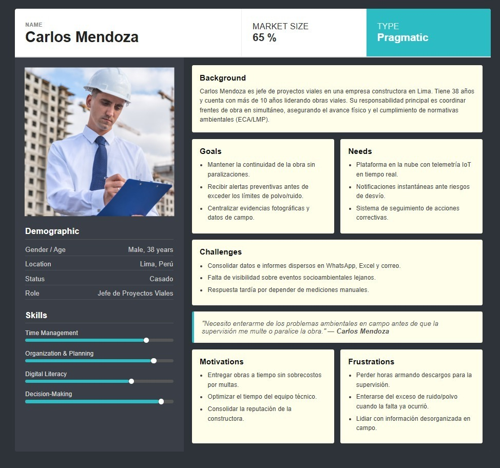

**Segmento 2**

Para el Segmento 2 (Empresas Supervisoras Ambientales / Consultoras - Módulo de Fiscalización) se elaboró el User Persona Gisela Chavez. Se consideraron factores como su rol de Directora de Operaciones en una consultora ambiental, su vasta experiencia liderando auditorías y fiscalizaciones de proyectos de transporte a nivel nacional, y su necesidad de auditar el cumplimiento regulatorio de múltiples frentes de obra de forma transparente e imparcial. Sus principales frustraciones se relacionan con la falta de visibilidad centralizada por la dispersión de informes fragmentados provenientes de distintas constructoras, la pérdida de tiempo administrativo al navegar entre correos o reportes estáticos y la fricción que se genera al existir discrepancias de datos sobre posibles incumplimientos ambientales. Asimismo, se tomó en cuenta su alto nivel de competencias en gestión y planificación, y su necesidad de una plataforma SaaS que permita unificar los datos de cumplimiento en tiempo real, automatizar la generación de reportes oficiales respaldados por datos inalterables y priorizar la atención de auditorías mediante métricas claras de riesgo.

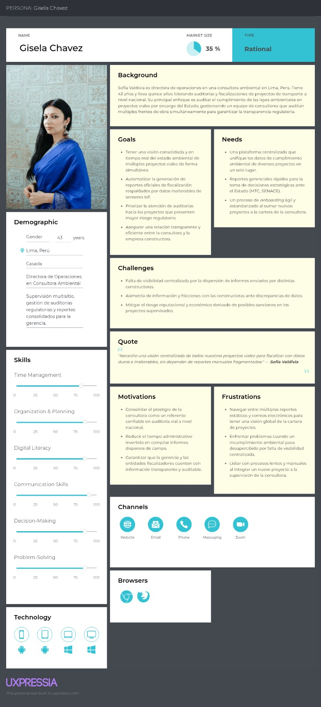

### 2.3.2. User Task Matrix

En esta sección se desarrolla el User Task Matrix, en el cual se identifican las principales actividades que realizan los User Personas de **RoadWatch**: los **Administradores de Flotas Logísticas** (Segmento 1) y los **Operadores de Centros de Control de Tráfico** (Segmento 2). 

Estas tareas corresponden a acciones habituales dentro de su dinámica operativa, necesarias para alcanzar sus objetivos de movilidad y seguridad, sin depender necesariamente de una solución digital unificada. Este análisis nos permite comprender cómo monitorean y gestionan las vías actualmente, así como detectar ineficiencias y oportunidades donde RoadWatch puede generar valor.

**Segmento 1: Administradores de Flotas Logísticas (ej. Carlos)**

| Task | Frequency | Importance |
|---|---|---|
| Seguimiento en tiempo real de la ubicación de las unidades | Daily | Critical |
| Planificación y reasignación de rutas por tráfico pesado | Daily | High |
| Evaluación de tiempos de llegada para cumplir con clientes | Daily | Critical |
| Revisión de historial de rutas y tiempos muertos | Weekly | Medium |
| Coordinación con conductores (avisos de peligros en la vía) | Daily | High |
| Gestión de contingencias (averías, accidentes de la flota) | Occasionally | High |
| Reporte de cumplimiento de entregas y eficiencia de ruta | Weekly | Medium |
| Actualización manual del estado de las vías (grupos de chat) | Constant | High |

**Análisis**

- **Foco en la Optimización de Tiempos:** La alta frecuencia y criticidad del seguimiento diario y la reasignación de rutas confirman que el éxito operativo del Administrador de Flotas depende de la visibilidad constante sobre las condiciones del tráfico para evitar retrasos.
- **Conflicto de Eficiencia:** Existe una clara contradicción entre la necesidad de "garantizar entregas a tiempo" y la dependencia de la actualización manual (vía WhatsApp o radio) con los conductores. Esta última tarea actúa como un cuello de botella que consume tiempo y no permite anticiparse al tráfico.
- **Prioridad Estratégica:** La matriz revela que su valor principal no es solo logístico, sino comercial y financiero: alinear la eficiencia de la ruta con la satisfacción del cliente final y la reducción de costos operativos (combustible y horas hombre).

---

**Segmento 2: Operadores de Centros de Control de Tráfico (ej. Elena)**

| Task | Frequency | Importance |
|---|---|---|
| Monitorear el estado de la red vial en múltiples sectores | Constant | Critical |
| Detectar y verificar incidentes graves (accidentes, bloqueos) | Daily | Critical |
| Coordinar con servicios de emergencia y patrullas de campo | Constant | High |
| Supervisar el impacto de obras viales o eventos masivos | Weekly | Medium |
| Consolidar información de congestión para toma de decisiones | Biweekly | High |
| Emitir alertas preventivas sobre vías cerradas o peligros | Daily | Critical |
| Revisar reportes ciudadanos o de otras fuentes fragmentadas | Constant | High |

**Análisis**

- **De la Reacción a la Estrategia:** Las tareas con frecuencia Constante/Diaria e importancia Crítica (Monitoreo, Detección de Incidentes y Alertas) mantienen al operador en un estado "reactivo". Centralizar y automatizar la detección de incidentes en RoadWatch permitirá que pasen de ser "apagadores de incendios" a estrategas preventivos de la movilidad.
- **Vacío Tecnológico Peligroso:** El hecho de que la "Detección de incidentes" sea crítica, pero muchas veces dependa de fuentes fragmentadas o cámaras no integradas, revela un punto de dolor enorme. Las alertas geolocalizadas y automáticas son la funcionalidad "gancho" que asegura la adopción indispensable de la plataforma.
- **Desconexión entre Detección y Acción:** Existe una brecha entre la detección del incidente y la coordinación con emergencias. Al utilizar sistemas separados (mapas en una pantalla, radios/teléfonos en otra), el reporte histórico de la ciudad nunca refleja con exactitud los tiempos reales de respuesta. Integrar esto es clave para RoadWatch.

### 2.3.3. User Journey Mapping

**Segmento 1**

El recorrido de Carlos Mendoza abarca una perspectiva operativa y de gestión ambiental en proyectos viales, dividida en: 1. Planificación del frente de obra y definición de límites normativos ambientales, 2. Registro diario de mediciones en campo, 3. Detección de alertas por posibles excedencias de ruido o polvo, 4. Ejecución de acciones correctivas o de mitigación, 5. Consolidación del reporte mensual, y 6. Auditoría y cierre ante la supervisión.

El mayor cuello de botella en el viaje de Carlos se concentra en las etapas 2, 3 y 5. Debido a la dispersión de información en WhatsApp, Excel, fotos y reportes manuales, el registro de datos de campo no se realiza de forma centralizada ni en tiempo real. Esto dificulta detectar excedencias ambientales antes de que se conviertan en observaciones o sanciones, y además vuelve lenta la consolidación del expediente mensual. Como consecuencia, Carlos queda expuesto a demoras operativas, pérdida de trazabilidad y riesgo de multas o paralizaciones por falta de evidencia ordenada y oportuna.

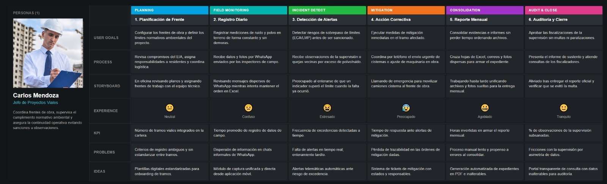

**Segmento 2**

El recorrido de Gisela abarca una perspectiva directiva y de fiscalización macro, dividida en: 1. Incorporación y onboarding de un nuevo proyecto vial a la cartera, 2. Supervisión periódica y seguimiento multisitio, 3. Solicitud de reportes de cumplimiento a las constructoras, y 4. Consolidación de informes oficiales para la gerencia y entidades de control (MTC/SENACE).

El mayor cuello de botella en el viaje de Gisela se concentra en las etapas 2 y 3. Debido a la asimetría de información y a la falta de una plataforma centralizada, recopilar y unificar los reportes de múltiples proyectos al mismo tiempo le demanda cruzar correos y llamadas de forma constante. Esto la expone a demoras operativas y a un alto riesgo reputacional si algún problema ambiental pasa desapercibido por la falta de visibilidad en tiempo real.

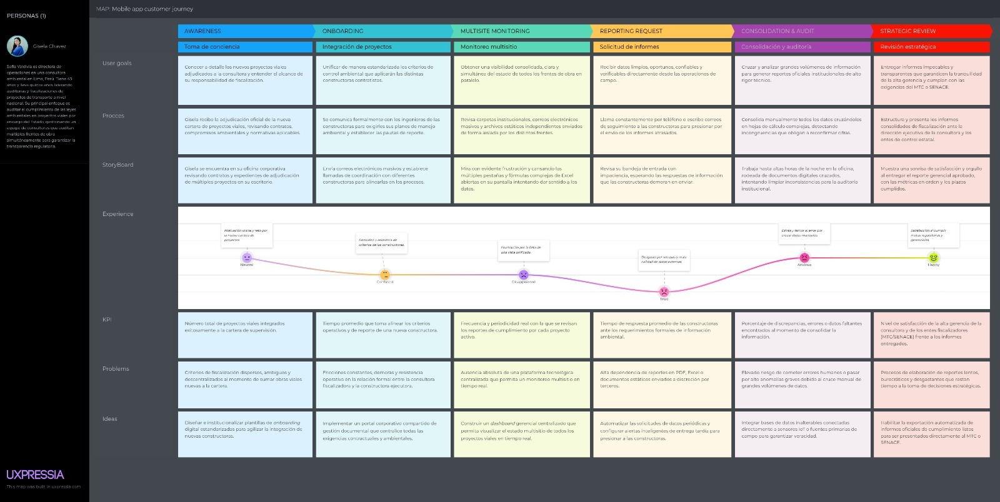

### 2.3.4. Empathy Mapping

**Segmento 1**

Para el Empathy Mapping del Segmento 1 (Empresas Constructoras Viales – Módulo Operativo) se analizó a Carlos Mendoza, Jefe de Proyectos Viales en una empresa constructora de Lima, responsable de coordinar diversos frentes de obra y garantizar la continuidad operativa y el cumplimiento de las normativas ambientales. Carlos piensa que una paralización de obra por multas ambientales podría afectar gravemente la rentabilidad del proyecto y se siente frustrado por la falta de visibilidad en tiempo real sobre lo que ocurre en frentes de obra lejanos, además de preocuparse por reaccionar demasiado tarde ante posibles desviaciones de contaminación. Escucha exigencias de la alta gerencia para no retrasar los plazos del proyecto, reclamos de comunidades por la generación de polvo o ruido, observaciones de la supervisión ambiental y quejas del personal técnico por la carga que implica elaborar reportes manuales. En su entorno observa una operación dinámica, pero desorganizada en el manejo de la información, con chats de WhatsApp saturados de fotografías no clasificadas, hojas de Excel con mediciones manuales que llegan con retraso, maquinaria pesada trabajando cerca de zonas sensibles y fiscalizadores realizando inspecciones sin previo aviso. Carlos suele expresar que necesita enterarse de los problemas ambientales antes de que la supervisión imponga una multa o paralice la obra, y manifiesta que no puede seguir perdiendo horas revisando chats y consolidando información manualmente. En su actuar diario llama constantemente a los ingenieros de campo para solicitar reportes urgentes, revisa registros dispersos en Excel y carpetas de imágenes, coordina acciones de mitigación como la salida de camiones cisterna y prepara descargos técnicos de último momento frente a observaciones de la supervisión. Su principal dolor es la ausencia de una visibilidad centralizada y en tiempo real de los indicadores ambientales, la alta dependencia de procesos manuales y el riesgo de enterarse de una excedencia cuando ya se produjo una observación o sanción; mientras que su ganancia esperada es contar con un panel unificado que permita monitorear todos los tramos viales en tiempo real, recibir alertas preventivas, centralizar evidencias fotográficas trazables y optimizar el tiempo del equipo técnico, logrando mayor control operativo y reduciendo el riesgo de multas o paralizaciones.

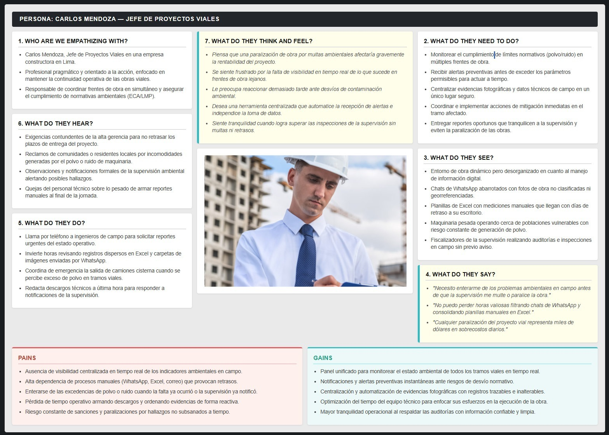

**Segmento 2**

En este mapa se analizó a Gisela Chávez, una jefa de supervisión ambiental y consultora senior encargada de fiscalizar, consolidar y auditar múltiples proyectos viales a nivel institucional. Ella piensa que la consultora está expuesta a sanciones graves debido a la asimetría de datos de los contratistas y se siente abrumada por la falta de una vista unificada y la pesada carga de análisis manual. Escucha exigencias rigurosas de cumplimiento normativo por parte de entidades como el MTC y el SENACE, presiones directas de la alta gerencia sobre plazos fatales y excusas recurrentes de los ingenieros de campo sobre retrasos en el envío de información. En su entorno observa una oficina corporativa digitalizada pero caótica, un laberinto de bandejas de correo repleta de archivos estáticos (PDFs y Word) enviadas fuera de plazo y hojas de cálculo en Excel llenas de pestañas interminables y fórmulas complejas. Gisela suele expresar la necesidad de contar con una plataforma centralizada que permita monitorear todos los frentes en tiempo real y manifiesta su frustración porque la información de campo siempre llega tarde o incompleta. En su actuar diario envía correos masivos de seguimiento, pasa horas intentando unificar bases de datos fragmentadas enviadas por terceros y trabaja hasta altas horas de la noche redactando los expedientes regulatorios oficiales. Su dolor principal es la ausencia de visibilidad centralizada en tiempo real, la alta dependencia de reportes manuales y el riesgo de cometer errores humanos al cruzar datos, mientras que su ganancia esperada es disponer de un panel gerencial (dashboard) multisitio que unifique la información con datos trazables e inalterables, automatice la generación de informes oficiales y le otorgue mayor control estratégico y tranquilidad.

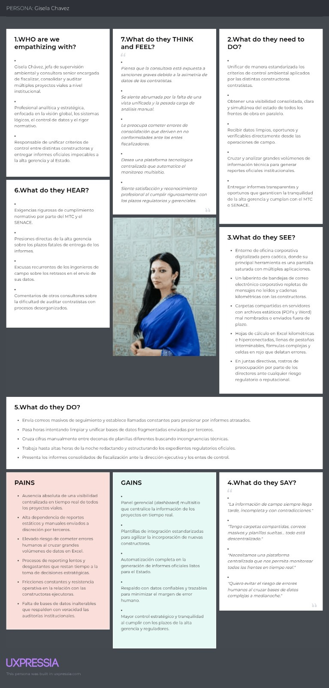

## 2.4. Big Picture EventStorming

### Step 1 – Unstructured Exploration

En esta etapa preliminar, el equipo realizó un taller de ideación abierta sobre un lienzo digital interactivo con el fin de explorar de manera integral el contexto operativo del proyecto. El propósito fue capturar, sin limitaciones estructurales, la totalidad de interacciones, actores, flujos de trabajo y eventos críticos involucrados en la gestión del monitoreo socioambiental vial. Este ejercicio libre permitió poner en evidencia los principales cuellos de botella del modelo actual, destacando la ineficiencia del levantamiento manual de información, la falta de canales de comunicación centralizados y la sobrecarga administrativa al consolidar expedientes para las entidades fiscalizadoras.

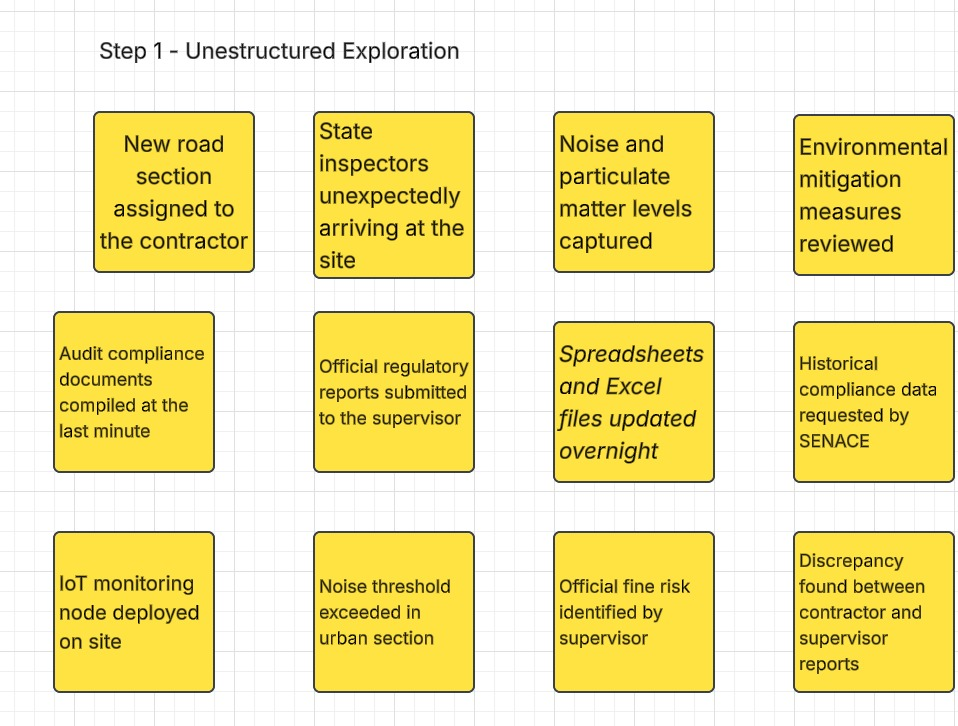

### Step 2 – Timelines

Posteriormente a la sesión de ideación abierta, el equipo organizó los eventos de dominio en una secuencia temporal lineal de izquierda a derecha. Para otorgar estructura metodológica al flujo, los acontecimientos se agruparon en cinco etapas secuenciales que reflejan la dinámica real de la supervisión ambiental en proyectos de infraestructura:

* **Setup & Baseline:** Comprende los hitos iniciales de asignación de tramos viales y la instalación del equipamiento telemático en el terreno.
* **Field Execution & Monitoring:** Integra el seguimiento continuo de variables normativas (ruido y aire) junto con la detección automática de alertas en áreas de impacto.
* **Contingency & Reporting:** Refleja la gestión de incidentes y la identificación de incongruencias de información que exponen al proyecto a multas regulatorias.
* **Consolidation & Analysis:** Agrupa las tareas administrativas complejas vinculadas al procesamiento tardío de datos y la estructuración de expedientes de cumplimiento.
* **Fiscalization & Audit:** Enmarca la fase final ante inspecciones estatales no programadas, la validación de respuestas correctivas y la entrega formal de información histórica a los organismos de control.

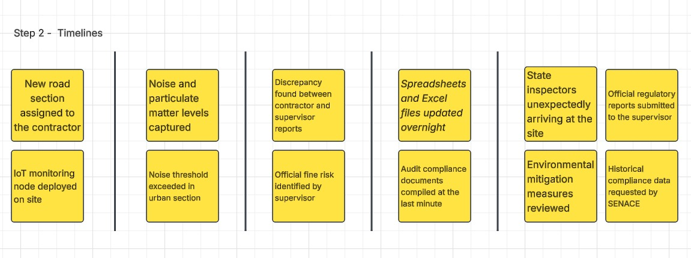

## 2.5. Ubiquitous Language

## 2.5. Ubiquitous Language

Con el propósito de mantener una comunicación transparente, estandarizada y libre de ambigüedades entre todos los miembros del equipo técnico, de producto y los stakeholders, se establece el siguiente glosario de términos y conceptos propios del dominio de negocio, fundamentado en los principios de Domain-Driven Design (DDD) de Eric Evans. Mantener un Ubiquitous Language completo y actualizado asegura que tanto los desarrolladores como los expertos de dominio compartan el mismo modelo mental y conceptual dentro de **RoadWatch OS**.

A continuación, se detallan los términos clave del dominio socioambiental vial definidos para nuestros segmentos objetivo (*Empresas Constructoras Viales* y *Empresas de Mantenimiento y Rehabilitación Vial*):

* **Environmental Monitoring (Monitoreo Ambiental):** Proceso sistemático de medición, registro y evaluación en tiempo real de variables críticas de impacto ambiental (como nivel de presión sonora dB(A), material particulado PM10/PM2.5, calidad de agua y vibraciones) capturadas mediante nodos telemáticos IoT desplegados en los tramos y frentes de obra vial.

* **Road Construction Company (Empresa Constructora Vial):** Organización ejecutora responsable de la construcción de nuevas vías y carreteras, encargada de la gestión operativa, del cumplimiento de las obligaciones ambientales y del despliegue de medidas de mitigación en sus frentes de trabajo.

* **Road Maintenance and Rehabilitation Company (Empresa de Mantenimiento y Rehabilitación Vial):** Organización contratista responsable de la conservación, mantenimiento periódico y rehabilitación de infraestructura vial existente, con la obligación de controlar y mitigar los impactos socioambientales continuos generados por el tránsito pesado y la maquinaria de obra en carreteras abiertas.

* **Site Resident (Residente de Obra / Residente de Mantenimiento):** Profesional técnico desplegado en campo, responsable directo de la ejecución del proyecto o de las labores de conservación vial. Es el encargado de supervisar el cumplimiento de la normativa socioambiental, gestionar los recursos en terreno y coordinar la atención inmediata de incidencias ambientales.

* **Regulatory Audit (Auditoría Regulatoria / Fiscalización):** Proceso formal de inspección y revisión documental llevado a cabo por entidades fiscalizadoras oficiales (como el OEFA o el MTC) para verificar la conformidad legal de los registros históricos telemáticos y el cumplimiento de los compromisos ambientales de la obra.

* **Threshold Deviation (Desvío de Umbral / Excedencia):** Evento detectado automáticamente por los nodos IoT de RoadWatch OS cuando una lectura de parámetro ambiental supera los Estándares de Calidad Ambiental (ECA) o los Límites Máximos Permisibles (LMP) configurados para un tramo vial específico.

* **Environmental Incident (Incidencia Ambiental):** Situación de riesgo o incumplimiento originada tras un desvío de umbral o reporte manual en campo. Requiere la apertura de un ticket de acción correctiva dentro de la plataforma, la asignación de un responsable y el registro de evidencias inalterables para su subsanación.

* **Compliance Report (Reporte de Cumplimiento):** Expediente consolidado y generado de forma automatizada por RoadWatch OS que recopila la telemetría histórica, la trazabilidad de alertas, el estado de las incidencias e imprecisión nula de datos, diseñado para ser presentado ante la supervisión y auditorías externas.

