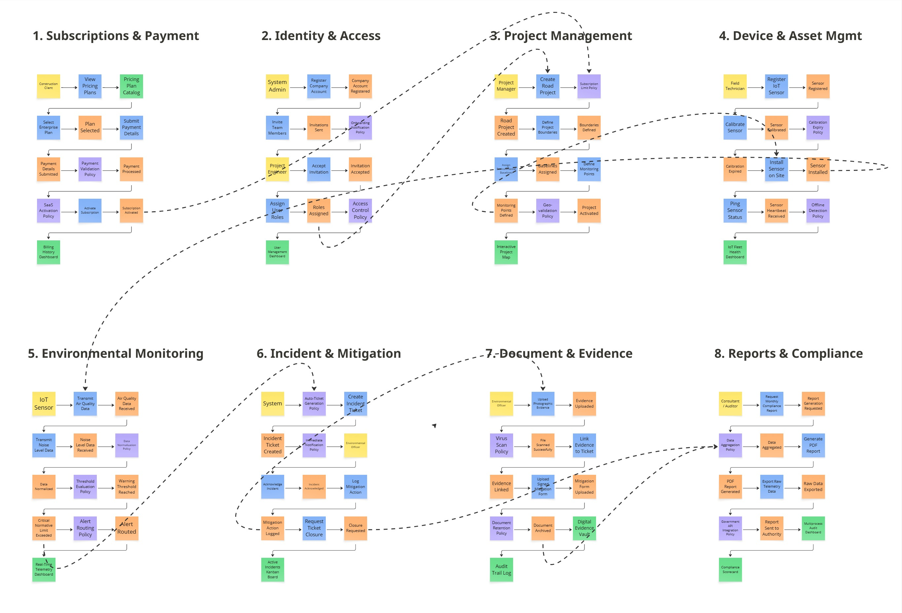

# Product Design
## 4.1. Style Guidelines.

### 4.1.1. General Style Guidelines.

**Colores**

- **Azul primario – #1E40AF:**

- **Gris azulado secundario – #475569:**

- **Marrón acento – #882D00:**

- **Gris neutro – #64748B:**

- **Escalas de color:**

**Tipografía**

**Branding**

**Espaciado**

**Dimensiones para el tono de comunicación y lenguaje aplicado**

- **Consistencia:**

- **Navegación:**

- **Accesibilidad:**

**Elementos de Diseño**

**Principios de Diseño**

### 4.1.2. Web Style Guidelines.

## 4.2. Information Architecture.

### 4.2.1. Organization Systems.

### 4.2.2. Labeling Systems.

**Landing Page**

* 

* 

* 

* 

* 

**Aplicación Web - Project Managers y PMO Leads**

* 

* 

* 

* 

* 

* 

* 

**Aplicación Web – Stakeholders**

* 

* 

* 

* 

### 4.2.3. SEO Tags and Meta Tags.

* **Title Tag:** en html: 

* **Description:** en html:

* **Keywords:** en html:

* **Open Graph (Optimización para redes sociales):**
    * 

    * 

    * 

    * 

* **Robots:** en html:

### 4.2.4. Searching Systems.

1. **Barra de Búsqueda Global:**
    * 
    * 
    * 
2. **Filtro de Avances:**
    * **Indicadores de Salud:**
    * **Estado Operativo:**
    * **Prioridad y Carga:**
3. **Búsqueda Documental:**

### 4.2.5. Navigation Systems.

1. **Navegación Global (Menú Lateral):**
    * **Dashboard:**
    * **Proyectos:**
    * **Reportes:**
    * **Riesgos:**

2. **Navegación de Contexto:** 

3. **Navegación Local:** 

4. **Acciones Rápidas:** 

## 4.3. Landing Page UI Design.

### 4.3.1. Landing Page Wireframe.

**LADING PAGE WEB**

**Barra de Navegación**:

**Título Principal**:

**Texto**:

**Llamados a la Acción**:

**Elemento Visual**:

**Sección de Pilares de Gestión**:
- **Pilar 1**:
- **Pilar 2**:
- **Pilar 3**:

**Contenido**:

**Flujo de Onboarding**:

- 1:
- 2:
- 3:

**Logotipos**:

**Pie de Página**:

**LADING PAGE MOBILE**

**Cabecera y Navegación**:

**Headline**:

**Imagen de Soporte**:

1. **Pilares de Gestión**:

2. **Beneficios Enumerados**:

3. **Sección de Autoridad Técnica**:

**Flujo de Usuario y Conversión**:

**Testimonios**:

**Logos de Respaldo**:

**Cierre**:

**Newsletter**:

### 4.3.2. Landing Page Mock-up.

**LADING PAGE MOCK-UP WEB**

**Barra de Navegación**:

**Título Principal**:

**Cuerpo de Texto**:

**Llamados a la Acción**:

**Elemento Visual Principal**:

**Sección de Pilares de Gestión**:
- **Pilar 1**:
- **Pilar 2**:
- **Pilar 3**:

**Sección de Transformación y Beneficios**:
- **01. Control**:
- **02. Alineación**:
- **03. Comunicación**:
- **04. Datos**:

**Testimonios**:

**Logotipos**:

**Final**:

**Newsletter**:

**Pie de Página**:

**LADING PAGE MOCK-UP MOBILE**

**Header y Navegación**:

**Título (H1)**:
**Texto**:

**Opciones**:

**Elemento Visual**:

**Cuerpo de Contenidos**:
1. **Pilares de Gestión**:
2. **Beneficios Enumerados (01-04)**:
3. **Autoridad y Respaldo**:

**Onboarding en Pasos**:

**Testimonios**:

**Logos de Respaldo**:

**Cierre**:

**Newsletter**:

**Footer Organizado**:

## 4.4. Web Applications UX/UI Design.

### 4.4.1. Web Applications Wireframes.

**Web applications** 

 Wireframe - Team Chat Hub (Desktop) 

Wireframe - Quick Reports (Desktop)

Wireframe - Profile & Settings (Desktop)

Wireframe - My Projects (Desktop)

Wireframe - Home Leader Hub (Desktop)

Wireframe - Team Board (Desktop)

Wireframe - Meetings & Agreements (Desktop)

Wireframe - Profile (Desktop)

Wireframe - Resource Planning (Desktop)

Wireframe - Risk & Compliance (Desktop)

Wireframe - Advanced Analytics (Desktop)

Wireframe - Settings (Desktop)

Wireframe - Portfolio Master (Desktop)

Wireframe - Home Leader Hub (Desktop)

**Web applications mobil** 

Wireframe - Team Chat Hub (Mobile)

Wireframe - Quick Reports (Mobile)

Wireframe - My Projects (Mobile)

Wireframe - Profile & Settings (Mobile)

Wireframe - Leader Hub Home (Mobile)

Wireframe - Team Board (Mobile)

Wireframe - Meetings & Agreements (Mobile)

Wireframe - Admin & System (Mobile)

Wireframe - Portfolio Master (Mobile)

Wireframe - Resource Planning (Mobile)

Wireframe - Risk & Compliance (Mobile)

Wireframe - Advanced Analytics (Mobile)

Wireframe - Admin Settings (Mobile)

Wireframe - Executive Profile (Mobile)

## 4.4.2. Web Applications Wireflow Diagrams.

## 4.4.3. Web Applications Mock-ups.

**Versión Desktop Mockups - Líderes y Jefes de Gestión de Proyectos** 

**El usuario inicia con el Login correspondiente colocando sus datos**

**El siguiente paso es escoger el workspace que se adapta mejor al usuario**

**El usuario puede olvidar su contraseña y decide cambiar su contraseña**

**El usuario entra y lo primero que se observa es el Home de la aplicación web**

**Después de presionar Apply Optimization aparece el mensaje Optimization Applied Successfully**

**El usuario se dirige a la sección de su perfil donde puede ver sus datos**

**El usuario desplega la sección Team Board en la cual se observa la función Operativa**

**El usuario despliega la sección Reports donde puede exportar diferentes proyectos**

**El usuario despliega la sección ChatHub donde puede ver los canales de sus compañeros**

**El usuario despliega la sección My Projects donde puede contemplar sus diversos proyectos**

**Aquí el usuario puede ir a Team Heatmap de un proyecto y ver el Resource Management**

**El usuario también puede ver los Quick Reports en la plataforma**

**El usuario despliega la sección Budgets y contempla la función Executive Health Summary**

**El usuario despliega la sección Meetings y en ella puede ver los Meetings y Agreements**

**El usuario puede exportar minutos de reuniones en los formatos visibles**

**El usuario se dirige a Schedule New Meeting para programar alguna reunión**

**Versión Desktop Mockups - Empresas Medianas y Grandes con Múltiples Portafolios**

**El usuario inicia con el Login correspondiente colocando sus datos**

**El siguiente paso es escoger el workspace que se adapta mejor al usuario**

**El usuario puede olvidar su contraseña y decide cambiar su contraseña**

**El usuario decide ir a la sección de Projects y seleccionar su Portafolio**

**El usuario se dirige a la seccipin de Resource Planning donde mira el Team Bandwidth Analysis**

**El usuario también se puede dirigir a la sección de Team Optimization para ver los resultados**

**El usuario entra y lo primero que se observa es el Home de la aplicación web**

**El usuario se dirige a la sección de Portfolio Results y contempla su análisis**

**El usuario se dirige a la sección de Risk & Compliance donde contempla el Heatmap**

**El usuario se dirige a Action Plans para la mitigación de riesgos**

**El usuario se dirige a la sección de analytics donde aprecia el Advanced Analytics**

**El usuario puede compartir su perfil a través de su configuración**

**El usuario se dirige a la sección de su Perfil y puede ver su información personal**

**El usuario se dirige a la herramienta de Settings**

**Puede dirigirse a la configuración de integraciones**

**Puede dirigirse a la configuración de los miembros del equipo**

**Puede dirigirse a la configuración de notificaciones**

**Versión Mobile Mockups - Líderes y Jefes de Gestión de Proyectos** 

**El usuario inicia con el Login correspondiente colocando sus datos**

**El siguiente paso es escoger el workspace que se adapta mejor al usuario**

**El usuario puede olvidar su contraseña y decide cambiar su contraseña**

**El usuario desplega la sección Board en la cual se observa la función Operativa**

**El usuario puede añadir una nueva tarea si el lo desea**

**El usuario se dirige a la sección de Meetings y puede acceder a múltiples funcionalidades**

**En la sección Log el usuario puede elaborar una nota rápida del registro para un proyecto**

**El usuario puede acceder a Calendar donde se puede apreciar mejor el calendario del equipo**

**El usuario se dirige a la sección de Chat donde puede acceder a la funcionalidad de Chat Hub**

**El usuario al presionar Attach Files puede subir archivos de manera adjunta**

**El usuario al desplegar la sección Reports puede realizar un generador de reportes**

**El usuario puede seleccionar un proyecto de la lista en donde puede seleccionar un proyecto de la lista**

**El usuario puede descargar el reporte en formato PDF**

**El usuario se dirige a la sección de su perfil y puede gestionar su información**

**El usuario puede dirigirse a la sección de Security y ver el tema de la autenticación**

**El usuario puede ver los detalles en su cuenta y a la vez puede gestionarlos**

**El usuario se dirige a Notifications Preferences para ver si quiere o no recibir estas mismas**

**El usuario despliega la opción de ver sus proyectos donde se aprecia mejor su organización**

**El usuario al entrar en la sección Calendar puede ver el calendario del equipo**

**El usuario entra y lo primero que se observa es el Home de la aplicación mobile**

**Versión Mobile Mockups - Empresas Medianas y Grandes con Múltiples Portafolios** 

**El usuario inicia con el Login correspondiente colocando sus datos**

**El siguiente paso es escoger el workspace que se adapta mejor al usuario**

**El usuario puede olvidar su contraseña y decide cambiar su contraseña**

**El usuario puede dirigirse a la sección del Portfolio Govemance**

**El usuario se dirige a la sección de Admin & Systems Control**

**El usuario puede añadir una entidad para dicho portafolio que seleccione**

**El usuario se dirige a la función de Advanced Analytics**

**En base a lo que el usuario selecciono se genera un pronóstico**

**El usuario se dirige a la sección de Resources y va a la planificación de recursos**

**El usuario selecciona la sección de Risks y selecciona la función Risk & Compliance**

**El usuario por otro lado puede iniciar una auditoría para los proyectos**

**El usuario se dirige a la sección de Strategy y puede seleccionar la función del informe de la estrategia de contratación**

**El usuario visita su cuenta mobile y selecciona Account Settings**

**El usuario puede apreciar mejor su perfil y gestionarlo**

**El usuario puede visualizar a los Team Members de cada proyecto**

**El usuario se dirige a la sección Integrations de los proyectos**

# 4.4.4. Web Applications User Flow Diagrams.

## Segmento 1: Líderes y Jefes de Gestión de Proyectos
**User Flow Web** 

**El usuario valida sus credenciales al ingresar a Vantage PMO**

**El usuario escoge su espacio de trabajo a su comodidad**

**El usuario puede ir a su perfil para gestionar alguna característica**

**El usuario puede acceder a la sección del Team Board y sus funciones**

**El usuario accede tanto al Chat Hub de los proyectos y Team Headmap**

**El usuario puede ver sus proyectos activos y a detalle**

**El usuario accede a las secciones tanto de Quick Reports y Budgets**

**El usuario puede acceder a la sección de Meetings & Agreements**

**También puede optar por presionar el botón Schedule Meeting**

**User Flow Mobile** 

**El usuario valida sus credenciales al ingresar a Vantage PMO**

**El usuario escoge su espacio de trabajo a su comodidad**

**Este es el menú para el usuario donde aparecen múltiples opciones**

**Aquí el usuario accede a la sección Board la cual permite añadir tareas**

**El usuario puede acceder a la sección del chat y visita su perfil**

**El usuario accede a algunas opciones del System Settings**

**El usuario presiona Notification Preferences, otra función de System Settings**

**El usuario puede acceder a la sección de Reports donde hay diversas funcionalidades**

**El usuario accede a la sección Projects donde se observa el Team Bandwidth**

**El usuario puede acceder a la sección Meetings & Agreements**

**El usuario puede acceder a la sección Log Quick Note y Attach Files**

**El usuario puede acceder a la sección Schedule New junto con la de Projects**

## Segmento 2: Empresas Medianas y Grandes con Múltiples Portafolios
**User Flow Web** 

**El usuario valida sus credenciales al ingresar a Vantage PMO**

**El usuario escoge su espacio de trabajo a su comodidad y aparece la pantalla principal**

**El usuario puede acceder a la sección de Resource Planning**

**El usuario puede acceder a la sección Account y el usuario puede compartir su perfil**

**El usuario puede acceder a la sección de Settings**

**El usuario puede acceder a más funciones de la sección Settings**

**El usuario puede acceder a la sección de Analysis y se dirige a su Portafolio**

**El usuario puede acceder a la sección Projects**

**El usuario puede acceder a la sección Risk & Compliance, el usuario accede a más funciones**

**User Flow Mobile** 

**El usuario valida sus credenciales al ingresar a Vantage PMO**

**El usuario escoge su espacio de trabajo a su comodidad**

**El usuario se encuentra en la pantalla de inicio**

**El usuario puede acceder a la sección Healthy, también a otras funciones**

**El usuario al presionar Add Entity, continua con las Advanced Analytics**

**El usuario puede seleccionar Generate Forecast**

**El usuario puede acceder a Capacity & Bandwidth Analysis**

**El usuario presiona Initiate Audit y se va a Hiring Strategy Report**

**El usuario se dirige a la configuración de la cuenta, para seleccionar su información**

**El usuario puede ver a los Team Members, tambien el architect de si mismo**

## 4.5. Web Applications Prototyping.

## 4.6. Domain-Driven Software Architecture.

### 4.6.1. Design-Level EventStorming.

En esta sesión de Design-Level EventStorming, el equipo profundizó en la arquitectura orientada a eventos de **RoadWatch**. Se identificaron los límites transaccionales exactos (Bounded Contexts) que modularizan el sistema SaaS y el flujo IoT, mapeando la coreografía de eventos que automatiza la respuesta ante infracciones ambientales.

**Global EventStorming Map**

  

*Leyenda de Elementos Aplicados*
<table align="center">
  <tr>
    <td align="center" style="background-color: #FDE181; color: #000;">
      <b>User / Actor (Amarillo)</b> Quien ejecuta la acción
    </td>
    <td align="center" style="background-color: #8CD2F5; color: #000;">
      <b>Command (Azul)</b> La intención o acción a ejecutar
    </td>
    <td align="center" style="background-color: #F9A454; color: #000;">
      <b>Domain Event (Naranja)</b> Hecho relevante ocurrido
    </td>
  </tr>
  <tr>
    <td align="center" style="background-color: #C7ACF3; color: #000;">
      <b>Policy (Morado)</b> Regla de negocio o automatización
    </td>
    <td align="center" style="background-color: #8BE78B; color: #000;">
      <b>Read Model / View (Verde)</b> Datos proyectados para el usuario
    </td>
    <td align="center">
      <b>Flujo Externo (Flechas)</b> Coreografía entre contextos
    </td>
  </tr>
</table>

#### Bounded Contexts Identificados

**1. Subscriptions & Payment Management**
Gestiona el ciclo de vida comercial del cliente (constructoras o consultoras). Se encarga de la selección de planes SaaS (Base, Pro, Enterprise), validación de pagos y la activación de la suscripción, liberando las políticas de acceso para el uso de la plataforma.

**2. Identity & Access Management (IAM)**
Administra la seguridad, el onboarding de empresas y el control de acceso basado en roles (RBAC). Asegura que solo ingenieros, técnicos o administradores autorizados puedan interactuar con los proyectos y sensores correspondientes.

**3. Project Management**
Contexto core para la creación y delimitación de los proyectos viales. Aquí los Project Managers definen las coordenadas geográficas de la obra, establecen las líneas base ambientales y determinan los puntos exactos donde se instalará el hardware de monitoreo.

**4. Device & Asset Management (IoT Fleet)**
Controla el ciclo de vida del hardware físico desplegado en campo. Los técnicos registran, instalan y calibran los sensores. Este módulo detecta caídas de conexión (offline) y expiraciones de calibración, garantizando la fiabilidad de los datos recolectados.

**5. Environmental Monitoring**
El motor telemétrico principal de RoadWatch. Recibe el flujo continuo de datos de calidad del aire y ruido desde los sensores IoT, normaliza la data y la evalúa contra los umbrales normativos vigentes. Si se excede un límite crítico, emite eventos de alerta inmediatos.

**Device and Asset Mgmt**

**6. Incident & Mitigation Management**
Módulo de reacción automatizada. Escucha los eventos críticos del monitoreo ambiental y dispara políticas de creación automática de tickets de incidencia. Gestiona el flujo de trabajo (workflow) para que los responsables ambientales ejecuten y registren las acciones de mitigación correspondientes.

**7. Document & Evidence Management**
Actúa como la bóveda digital y trazabilidad legal. Exige y almacena la evidencia fotográfica y los formularios firmados tras la mitigación de una incidencia, aplicando políticas de retención y escaneo de seguridad (virus scan) para mantener un *audit trail* inmutable.

**8. Reports & Compliance**
Consolida la información de todo el sistema para fines de auditoría. Agrega los datos telemétricos crudos y el historial de incidencias cerradas para generar reportes normativos automatizados en PDF y permitir la integración con APIs gubernamentales.

#### Arquitectura de Eventos y Coreografía (Relaciones Externas)
Para que RoadWatch funcione de manera autónoma, los microservicios se comunican asíncronamente mediante *Domain Events*:
* **Provisioning:** El evento `Subscription Activated` (C1) habilita la `Subscription Limit Policy` en Proyectos (C3). A su vez, `Roles Assigned` (C2) autoriza las interacciones técnicas en el sistema.
* **IoT Setup:** El evento `Monitoring Points Defined` (C3) es prerrequisito para ejecutar el comando `Install Sensor on Site` (C4), conectando la definición lógica del proyecto con la instalación física.
* **Motor Reactivo:** El hardware instalado (`Sensor Installed`) inicia la transmisión telemétrica (C5). Cuando el motor detecta una infracción y emite el evento `Critical Normative Limit Exceeded` (C5), este dispara directamente la `Auto-Ticket Generation Policy` en Incidencias (C6), eliminando el factor de error humano.
* **Trazabilidad Normativa:** El registro de una acción correctiva (`Mitigation Action Logged`, C6) bloquea el cierre del ticket hasta que se cumpla el comando `Upload Photographic Evidence` (C7). Finalmente, el cierre formal alimenta la `Data Aggregation Policy` (C8) para las auditorías.

### 4.6.2. Software Architecture Context Diagram.
El Diagrama de Contexto representa la vista de más alto nivel de RoadWatch, detallando cómo el sistema interactúa con los usuarios y sistemas externos sin profundizar en detalles técnicos.

#### Sistema Central

* **RoadWatch**: Solución integral para la gestión y monitoreo ambiental de proyectos de infraestructura vial, orientada a centralizar la información, detectar riesgos ambientales y facilitar el cumplimiento de las normativas.

#### Usuarios

##### Segmento A: Empresas Constructoras Viales

* Gestionan proyectos de construcción y mantenimiento de carreteras.
* Supervisan las condiciones ambientales de sus proyectos.
* Identifican y atienden riesgos e incidentes ambientales.
* Realizan seguimiento de medidas de mitigación y cumplimiento normativo.

##### Segmento B: Consultoras y Supervisoras Ambientales

* Supervisan el cumplimiento ambiental de múltiples proyectos.
* Realizan inspecciones y monitoreo de indicadores ambientales.
* Validan evidencias y acciones de mitigación.
* Elaboran reportes y dan seguimiento a las incidencias detectadas.

#### Sistemas Externos

* **Servicio de Mapas y Geolocalización**
  Permite visualizar proyectos, puntos de monitoreo e incidencias ambientales mediante información geográfica.

* **Servicio Meteorológico**
  Proporciona información climática que permite relacionar las condiciones ambientales con posibles riesgos dentro de los proyectos.

* **Servicio de Notificaciones**
  Permite enviar alertas automáticas a los responsables cuando se detectan riesgos, incidencias o condiciones que requieren atención.

#### Resumen de Interacción

* Los usuarios (Segmento A y B) interactúan directamente con **RoadWatch**.
* **RoadWatch** centraliza la información ambiental y gestiona:

  * Monitoreo de indicadores ambientales.
  * Registro y seguimiento de incidencias.
  * Acciones de mitigación y responsables.
  * Evidencias y trazabilidad de las actividades.
* **RoadWatch** integra servicios externos para:

  * Geolocalización mediante servicios de mapas.
  * Consulta de condiciones meteorológicas.
  * Envío de notificaciones y alertas.
* Los dispositivos **IoT** pueden enviar datos de sensores ambientales a RoadWatch, permitiendo detectar automáticamente condiciones fuera de los parámetros establecidos y generar alertas o incidencias para su atención.

### 4.6.3. Software Architecture Container Diagrams.
Este nivel desglosa el sistema RoadWatch en aplicaciones y componentes independientes, especificando las tecnologías y responsabilidades principales de cada contenedor que conforma la solución.

Web Application

Aplicación web desarrollada con Vue.js, encargada de proporcionar una interfaz interactiva para empresas constructoras viales y consultoras ambientales.

Permite:

Visualizar dashboards de monitoreo ambiental.
Gestionar proyectos y puntos de monitoreo.
Consultar incidencias y alertas.
Registrar y supervisar acciones de mitigación.
Visualizar información geolocalizada.
Consultar evidencias y generar reportes.

La aplicación se comunica con el backend mediante peticiones HTTPS hacia la API RESTful.

API Application

Construida en C# utilizando ASP.NET Core, constituye el núcleo de RoadWatch y centraliza la lógica de negocio y el procesamiento de la información ambiental.

Este componente se encarga de:

Gestionar proyectos y puntos de monitoreo.
Procesar información proveniente de los dispositivos IoT.
Analizar los valores de los indicadores ambientales.
Comparar los datos recibidos con umbrales configurados.
Generar automáticamente alertas e incidencias.
Gestionar acciones de mitigación y responsables.
Exponer endpoints RESTful para la Web Application.
Integrarse con servicios externos de mapas, clima y notificaciones.
IoT Monitoring

Componente encargado de recibir y gestionar los datos provenientes de sensores ambientales instalados en los proyectos viales.

Los dispositivos IoT pueden monitorear variables como:

Calidad del aire.
Nivel de ruido.
Temperatura.
Humedad.
Calidad del agua.

Los datos recopilados son enviados hacia la API Application, donde son procesados y evaluados según los parámetros ambientales establecidos. Cuando se detecta un valor fuera del rango permitido, RoadWatch puede generar automáticamente una alerta e incidencia para su atención.

Database

Motor de base de datos relacional basado en MySQL, responsable de almacenar de forma persistente la información generada por RoadWatch.

Garantiza:

Integridad de la información de los proyectos.
Persistencia de los datos de monitoreo ambiental.
Registro histórico de incidencias y alertas.
Trazabilidad de las acciones de mitigación.
Almacenamiento de responsables, evidencias y estados.
Consulta histórica para la generación de reportes.

La API Application es responsable de gestionar las operaciones de lectura y escritura sobre la base de datos, evitando que la Web Application acceda directamente a ella.

### 4.6.4. Software Architecture Components Diagrams.

En el nivel de componentes se detalla la descomposición interna de los contenedores de RoadWatch, mostrando los bloques estructurales que conforman la solución y las relaciones entre ellos. Debido a que la Web Application y la Database pueden ser complementadas mediante diagramas específicos de frontend y base de datos, esta sección pone especial énfasis en el contenedor API Application, donde se concentra la lógica de negocio y el procesamiento de la información ambiental.

El diagrama de componentes de la API Application organiza la arquitectura interna de RoadWatch de acuerdo con los principales contextos funcionales del dominio. Cada módulo backend representa un componente encargado de una responsabilidad específica:

Project Management Backend: administra los proyectos viales, sus datos generales, ubicaciones, estados y puntos de monitoreo asociados. Permite crear, consultar, actualizar y gestionar la información de los proyectos.
Environmental Monitoring Backend: procesa y administra los indicadores ambientales registrados en los proyectos, permitiendo consultar mediciones históricas y actuales de variables como calidad del aire, ruido, temperatura, humedad y calidad del agua.
IoT Integration Backend: gestiona la comunicación entre RoadWatch y los dispositivos IoT instalados en los proyectos. Recibe los datos provenientes de los sensores, valida las mediciones y las incorpora al sistema para su posterior análisis.
Risk & Incident Backend: analiza las mediciones ambientales y las compara con los parámetros establecidos. Cuando identifica condiciones que superan los límites permitidos, genera alertas e incidencias ambientales de manera automática.
Mitigation Backend: administra las acciones correctivas y medidas de mitigación asociadas a las incidencias. Permite asignar responsables, establecer fechas límite, actualizar estados y realizar el seguimiento hasta la resolución del problema.
Evidence Backend: gestiona las evidencias relacionadas con inspecciones, incidencias y acciones de mitigación, permitiendo registrar fotografías, documentos y otros archivos que respalden las actividades realizadas.
Reports Backend: centraliza la generación de reportes ambientales y de cumplimiento, utilizando la información almacenada de proyectos, mediciones, incidencias, acciones y evidencias.
Geolocation Backend: administra la información geográfica de proyectos, puntos de monitoreo e incidencias, integrándose con el servicio externo de mapas y geolocalización para representar visualmente la información.
Weather Backend: obtiene información meteorológica mediante el servicio externo correspondiente, permitiendo complementar el análisis de las condiciones ambientales y riesgos asociados a cada proyecto.
Notification Backend: gestiona el envío de alertas y notificaciones a los responsables cuando se generan incidencias, se detectan valores fuera de los parámetros establecidos o existen acciones de mitigación pendientes.
Shared Backend: proporciona componentes comunes, utilidades, validaciones, clases base, manejo de errores y mecanismos de infraestructura reutilizados por los demás módulos de la API.

En el diagrama se refleja cómo:

La Web Application consume los servicios expuestos por los componentes de la API Application mediante endpoints RESTful, permitiendo gestionar proyectos, monitoreo, incidencias, acciones de mitigación, evidencias y reportes.
El IoT Integration Backend recibe las mediciones provenientes del IoT Monitoring, validando y procesando los datos antes de almacenarlos.
El Environmental Monitoring Backend administra las mediciones ambientales y trabaja junto con el Risk & Incident Backend para identificar valores que excedan los umbrales establecidos.
El Risk & Incident Backend genera incidencias automáticamente cuando se detectan condiciones ambientales fuera de los parámetros permitidos y comunica estos eventos al Notification Backend.
El Mitigation Backend gestiona las acciones necesarias para resolver las incidencias, mientras que el Evidence Backend permite registrar evidencias que demuestren el cumplimiento de dichas acciones.
El Project Management Backend, Environmental Monitoring Backend, Risk & Incident Backend, Mitigation Backend, Evidence Backend y Reports Backend acceden a la Database para leer y escribir la información correspondiente a sus responsabilidades.
El Geolocation Backend se integra con el Servicio de Mapas y Geolocalización para obtener información geográfica y representar proyectos, puntos de monitoreo e incidencias.
El Weather Backend se comunica con el Servicio Meteorológico para obtener información climática utilizada como complemento para el monitoreo y análisis de riesgos.
El Notification Backend se integra con el Servicio de Notificaciones para enviar alertas a los responsables de los proyectos.
Todos los componentes backend pueden reutilizar las capacidades proporcionadas por el Shared Backend, favoreciendo la consistencia, reutilización de código y reducción de duplicidad.

De esta manera, el Component Diagram complementa los diagramas de clases y de base de datos de RoadWatch, mostrando cómo la API Application se divide en componentes coherentes con las funcionalidades principales del dominio y cómo estos colaboran entre sí para implementar el monitoreo ambiental, la detección de riesgos, la gestión de incidencias y las acciones de mitigación dentro de los proyectos viales.

## 4.7. Software Object-Oriented Design.

### 4.7.1. Class Diagrams.

Se centra en la definición de diagramas de clases, la interacción entre objetos y la aplicación de principios.

### Bounded Context 1 - Suscriptions and Payment:

### Bounded Context 2 - Identity and Access:

### Bounded Context 3 - Project Mangement:

### Bounded Context 4 - Device and Asset Mgmt:

### Bounded Context 5 - Environmental Monitoring:

### Bounded Context 6 - Incident and mitigation:

### Bounded Context 7 - Document and Evidence:

### Bounded Context 8 - Reports and Compliance:

## 4.8. Database Design.

El diseño de la base de datos relacional (MySQL) para RoadWatch OS adopta un enfoque de aislamiento por Bounded Context dentro del Monolito Modular, garantizando que cada módulo mantenga la propiedad exclusiva de su esquema y desacoplando persistencias mediante referencias por identificadores UUID.

Características Principales de la Base de Datos

Aislamiento de Módulos: Esquema lógico separado por Bounded Context donde las tablas pertenecientes a un contexto solo son accedidas mediante su propio módulo.

Identificadores Únicos (UUID): Uso de VARCHAR(36) para Primary Keys (PK) y Foreign Keys (FK), evitando dependencias por secuencias numéricas y facilitando integración entre módulos.

Integridad Referencial y 3NF: Aplicación de Tercera Forma Normal (3NF) con restricciones explícitas (PK, FK, UNIQUE, NOT NULL) para asegurar consistencia transaccional.

Campos de Auditoría Estandarizados: Todas las tablas incluyen created_at, updated_at y banderas de estado (status / is_deleted) para trazabilidad legal y soporte de auditorías ambientales.

### 4.8.1. Database Diagrams.

### Bounded Context 1 - Suscriptions and Payment:

### Bounded Context 2 - Identity and Access:

### Bounded Context 3 - Project Mangement:

### Bounded Context 4 - Device and Asset Mgmt:

### Bounded Context 5 - Environmental Monitoring:

### Bounded Context 6 - Incident and mitigation:

### Bounded Context 7 - Document and Evidence:

### Bounded Context 8 - Reports and Compliance:

